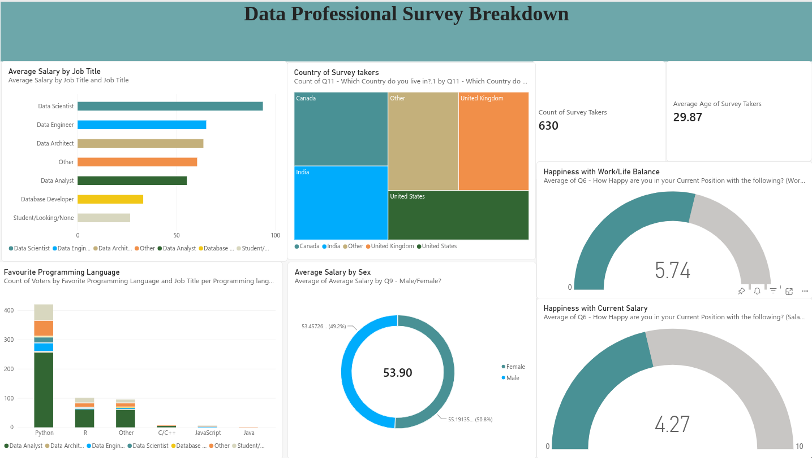

<h1 align="center">Power BI Data Visualization</h1>

  

## Project Overview

## 📌 Project Overview

This project analyzes survey responses from data professionals
using Microsoft Power BI.

The dataset contains 630 survey responses covering career roles,
salary, industry, programming languages, job satisfaction,
education, demographics, and career preferences.

## 🎯 Objectives

The dashboard explores questions such as:

- What are the most common roles among data professionals?
- How does salary vary across different data-related roles?
- Which programming languages are most popular?
- How satisfied are data professionals with their jobs?
- How difficult do professionals find it to break into data?
- How does salary vary by experience/role?
- What factors matter most when professionals consider a new job?
- What educational backgrounds are common among respondents?

## 📊 Key Dashboard Areas

### 1. Data Professional Demographics
- Age distribution
- Gender
- Country
- Education
- Ethnicity

### 2. Career & Industry
- Current job role
- Industry
- Career switchers
- Difficulty breaking into data

### 3. Salary Analysis
- Average salary
- Salary by job role
- Salary distribution
- Salary comparisons across industries

### 4. Technology
- Favorite programming languages
- Programming language popularity by role

### 5. Job Satisfaction
- Salary satisfaction
- Work/life balance
- Coworker satisfaction
- Management satisfaction
- Upward mobility
- Learning opportunities

## 🛠️ Tools Used

- Microsoft Power BI
- Microsoft Excel
- Power Query
- DAX

## 📁 Project Files

| File | Description |
|---|---|
| `alexreport.pbix` | Power BI dashboard |
| `op.png` | Dashboard preview |
| `Power BI - Final Project.xlsx` | Original survey dataset |

## 📈 Dataset

The dataset contains 630 responses from a survey of data
professionals and includes 28 variables covering demographics,
employment, compensation, technology preferences, education,
and job satisfaction.
